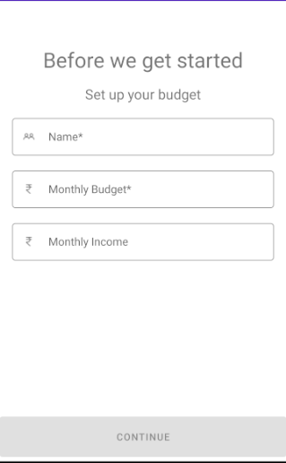
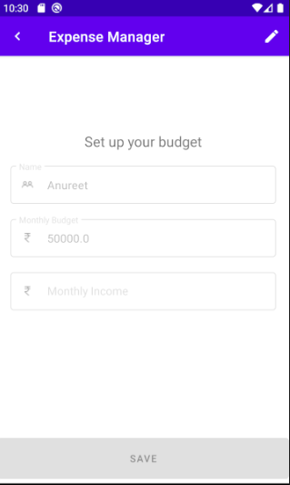
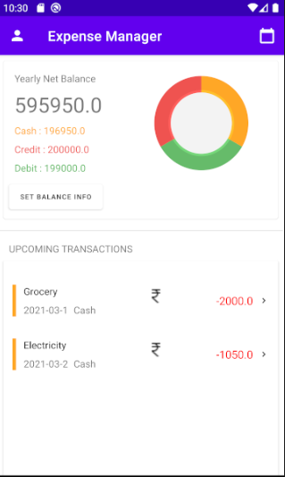
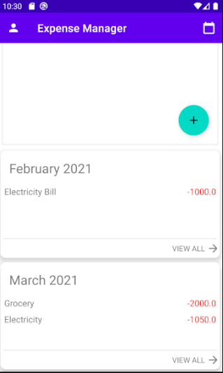
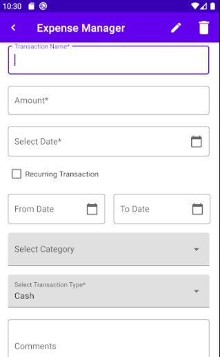
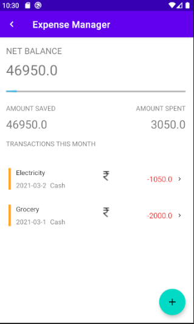
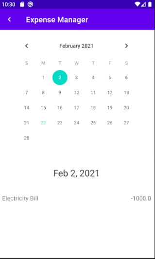

# ExpenseManager
An application to keep a log of daily expenses

This is an android application which is build using kotlin.

## Flash Screen and Profile Section

## Main Page 

## Add Transaction Page

## Month view and Calendar view

# Features
- [x] An onboarding screen to enter details such as name and budget.
- [x] Home Screen displays net balance with mode based segregation.
- [x] Home Screen displays upcoming transactions.
- [x] Once the expense for the month is added, a month card gets added to the screen automatically.
- [x] On clicking the month card, detailed view for the month is displayed.
- [x] The app calendar button in the menu bar opens a calendar view which displays the total/expense for a particular day.
